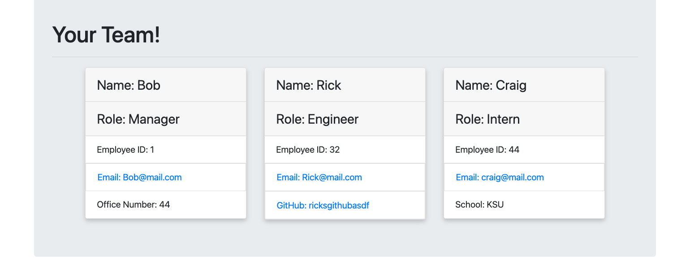

# Employee Generator 10_OOP

[](https://opensource.org/licenses/MIT)

## Description

This project creates cards for each type of employee that is input using inquirer.
This will create a clean display for entering a team of employees.

## Table of Contents (Optional)

- [Installation](#installation)
- [Usage](#usage)
- [Contribute](#contribute)
- [License](#license)

## Installation

Use the following command to install the dependecies.

    npm i

## User Story

```md
AS A manager
I WANT to generate a webpage that displays my team's basic info
SO THAT I have quick access to their emails and GitHub profiles
```

## Mock-Up

The following image shows a mock-up of the generated HTML’s appearance and functionality:




## Acceptance Criteria

```md
GIVEN a command-line application that accepts user input
WHEN I am prompted for my team members and their information
THEN an HTML file is generated that displays a nicely formatted team roster based on user input
WHEN I click on an email address in the HTML
THEN my default email program opens and populates the TO field of the email with the address
WHEN I click on the GitHub username
THEN that GitHub profile opens in a new tab
WHEN I start the application
THEN I am prompted to enter the team manager’s name, employee ID, email address, and office number
WHEN I enter the team manager’s name, employee ID, email address, and office number
THEN I am presented with a menu with the option to add an engineer or an intern or to finish building my team
WHEN I select the engineer option
THEN I am prompted to enter the engineer’s name, ID, email, and GitHub username, and I am taken back to the menu
WHEN I select the intern option
THEN I am prompted to enter the intern’s name, ID, email, and school, and I am taken back to the menu
WHEN I decide to finish building my team
THEN I exit the application, and the HTML is generated
```

---

## License

Licensed under the [MIT](https://choosealicense.com/licenses/mit/)

    MIT License

    Copyright (c) [2021] [Connor Gannaway]

    Permission is hereby granted, free of charge, to any person obtaining a copy
    of this software and associated documentation files (the "Software"), to deal
    in the Software without restriction, including without limitation the rights
    to use, copy, modify, merge, publish, distribute, sublicense, and/or sell
    copies of the Software, and to permit persons to whom the Software is
    furnished to do so, subject to the following conditions:

    The above copyright notice and this permission notice shall be included in all
    copies or substantial portions of the Software.

    THE SOFTWARE IS PROVIDED "AS IS", WITHOUT WARRANTY OF ANY KIND, EXPRESS OR
    IMPLIED, INCLUDING BUT NOT LIMITED TO THE WARRANTIES OF MERCHANTABILITY,
    FITNESS FOR A PARTICULAR PURPOSE AND NONINFRINGEMENT. IN NO EVENT SHALL THE
    AUTHORS OR COPYRIGHT HOLDERS BE LIABLE FOR ANY CLAIM, DAMAGES OR OTHER
    LIABILITY, WHETHER IN AN ACTION OF CONTRACT, TORT OR OTHERWISE, ARISING FROM,
    OUT OF OR IN CONNECTION WITH THE SOFTWARE OR THE USE OR OTHER DEALINGS IN THE
    SOFTWARE.

## Contribute

[](code_of_conduct.md)

Please give me credit! This is not an original idea but an original way to create this.

## Tests

Use the following command to run the "Jest" test.

    npm run test

## Questions

If you have any questions regarding this application please contact me at my GitHub here: (github.com/gannacon)

Or Send me an email: cwgannaway@gmail.com

---

© 2021 Connor Gannaway. All Rights Reserved.
